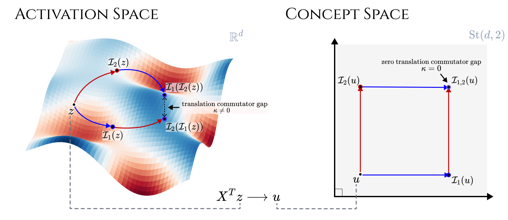

# Compositional Activation Steering via Stiefel Manifold Coordinate Transport
*Toan Doan, Thin Nguyen, Sunil Gupta*


This repository contains a core method implementation for StiCAS and the scripts to train and evaluate model.

This software project accompanies the research paper *StiCAS: Compositional Activation Steering via Stiefel Manifold Coordinate Transport*, published at NeurIPS 2026 ([bibtex](#Cite)).



---

## Codebase
> We're tidying up the code & artifacts for the camera-ready version

---

## Cite

```bibtex
@InProceedings{Doan_etal_26StiCAS,
  author    = {Doan, Toan and Nguyen, Thin and Gupta, Sunil},
  booktitle = {Advances in Neural Information Processing Systems (NeurIPS)},
  title     = {{StiCAS}: Compositional Activation Steering via {Stiefel} Manifold Coordinate Transport},
  year      = {2026},
}
```
